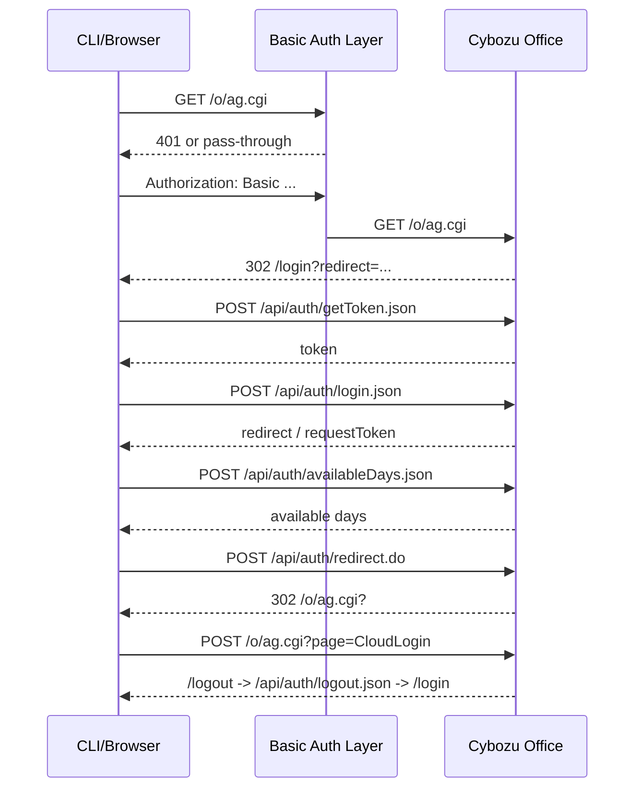

# 調査メモ

## 前提

対象 URL `https://example.cybozu.com/o/ag.cgi` は、パス構造から見てサイボウズ Office のスケジュール CGI を指している可能性が高いです。  
このリポジトリでは、まず公開されている一次情報を整理し、そこから分かる範囲と、実サイトを見ないと確定できない範囲を分離しています。

## 公開情報から確定できること

### 1. iCalendar 連携は公式に存在するが、読み取り用途

サイボウズ Office には、iCalendar 形式で予定データを出力する機能があります。  
管理者とユーザーの双方で設定が完了すると、ユーザーごとに `iCalendarURL` が発行され、その URL から予定データを取得できます。

公式マニュアルでは次の注意点が明記されています。

- `iCalendarURL` にアクセスすると、サイボウズ Office にログインしていないユーザーでも予定を確認できる
- URL の管理は利用者の責任で行う
- 検索エンジンに取得される恐れがある

このため、`iCalendarURL` は CRUD 用の安全な API として扱うべきではありません。  
読み取り専用のエクスポート機能としては使えますが、今回必要な「追加・変更・複製・削除」には不足します。

参考:

- <https://jp.cybozu.help/o/ja/admin/app/sh/ical.html>

### 2. UI 上は変更・複製・削除の操作が存在する

ユーザーマニュアルには、予定の変更・再利用・削除の手順が公開されています。

- 変更: 予定の詳細画面から `変更する`
- 複製: 予定の詳細画面から `再利用する` または `別の予定を登録する`
- 削除: 予定の詳細画面から `削除する`

つまり、ブラウザ UI では CRUD 相当の操作が成立しています。  
CLI 化するには、これらの画面遷移で使われるフォーム、hidden 項目、CSRF 対策、対象 ID を実サイトから採取する必要があります。

参考:

- <https://jp.cybozu.help/o/ja/user/app/sh/edit/normal.html>
- <https://jp.cybozu.help/o/ja/user/app/sh/view/reuse.html>
- <https://jp.cybozu.help/o/ja/user/app/sh/edit/delete.html>

### 3. 権限制御が強い

公式マニュアルには、変更・削除ができない条件として次が記載されています。

- 予定の変更や削除が、登録者と参加者のみに限定されている
- 変更や削除のアクセス権が付与されていない
- 非公開予定は設定によって挙動が変わる
- 繰り返し予定は「今回だけ」「以降すべて」「全体」など削除や変更の対象範囲が分岐する

したがって CLI では、単純な `PUT /events/{id}` のような発想ではなく、UI と同じ分岐を踏む必要があります。

## 実サイトを見ないと確定できないこと

### 1. Basic 認証の位置

今回のサイトは Basic 認証が必須とのことですが、これはサイボウズ Office 本体の認証ではなく、リバースプロキシや Web サーバで前段にかけられている可能性があります。  
その場合、CLI では次の 2 段階認証が発生し得ます。

1. Basic 認証
2. サイボウズ Office のログインフォームまたは SSO

### 2. 実際の HTML 契約

公開マニュアルからは操作の存在は分かりますが、次は分かりません。

- イベント ID の持ち方
- hidden 項目名
- CSRF トークンの有無と送信方法
- 追加/更新/削除/複製で使う `POST` 先
- 繰り返し予定や参加者複数予定での分岐パラメータ

### 3. 組織固有の制約

- SSO や IP 制限の有無
- 証明書エラーや社内 CA の要否
- 施設予約・アンケート・コメントなどをどこまで扱うか
- 非公開予定や仮予定を CLI から許可するか

## 事前知識チェックリスト

実装開始前に確認したい項目は次のとおりです。

- サイボウズ Office の対象バージョンと運用形態
- Basic 認証のユーザー名/パスワードの払い出し方法
- Office 本体ログインの方式
- テスト用ユーザーの権限
- テスト用カレンダーの用意
- 繰り返し予定・複数参加者予定・施設予約を対象に含めるか
- 監査ログや運用ルール上、CLI 自動操作が許可されるか

## このリポジトリでの結論

現段階で最も安全なのは、次の順序です。

1. 公式情報を整理する
2. `fixture` バックエンドで CLI とテストを先に完成させる
3. 実サイトで HTML 契約を採取する
4. 採取した契約に沿って `cybozu-html` バックエンドを実装する
5. 手元テストと運用ドキュメントを更新する

## 実サイト観測 2026-03-09

この節は、ログイン成功後のブラウザ観測で確認できた事実だけを記録します。  
個人名や固定値は一部伏せ、実装に必要なキーだけ残しています。

### 1. 認証フロー

観測できた認証系 URL は次のとおりです。

- 初期アクセス先: `https://example.cybozu.com/o/ag.cgi`
- Cybozu ログイン画面: `https://example.cybozu.com/login?redirect=https%3A%2F%2Fexample.cybozu.com%2Fo%2Fag.cgi%3F`
- Cybozu ログイン POST 先: `https://example.cybozu.com/api/auth/redirect.do`
- 認証後トップ: `https://example.cybozu.com/o/ag.cgi?`
- ログアウト起点: `POST ag.cgi?page=CloudLogin`

Basic 認証について:

- ブラウザの request headers で `Authorization: Basic ...` が `/o/ag.cgi` と `page=CloudLogin` に付いていることを確認した
- したがって、Cybozu Office 本体の前段に Basic 認証が存在する
- Basic 認証はブラウザ側でキャッシュされるため、Cybozu からログアウトしても同一セッションでは再入力不要だった

Cybozu ログインフォームについて:

- form action: `/api/auth/redirect.do`
- method: `POST`
- 入力項目:
  - `username`
  - `password`
  - hidden `redirect=https://example.cybozu.com/o/ag.cgi?`

再ログイン観測で確認できた API シーケンス:

1. `POST /api/auth/getToken.json?_lc=ja`
2. `POST /api/auth/login.json?_lc=ja`
3. `POST /api/auth/availableDays.json?_lc=ja`
4. `POST /api/auth/redirect.do`
5. `GET /o/ag.cgi?`
6. `GET /o/ag.cgi?page=ScheduleIndex`

主要点:

- `getToken.json` の request body に送る `__REQUEST_TOKEN__` は任意 UUID でよい
- 実際に後続 API が使うのは `getToken.json` の response body にある `result.token`
- `login.json` は `username`, `password`, `keepUsername`, `redirect`, `__REQUEST_TOKEN__` を JSON で送る
- `availableDays.json` も同じ `result.token` を `__REQUEST_TOKEN__` として送る
- `redirect.do` は最終的に `application/x-www-form-urlencoded` で `username`, `password`, `redirect` を送る
- `redirect.do` の response は `302 Location: https://example.cybozu.com/o/ag.cgi?`
- `/o/ag.cgi` は未ログイン時に HTTP 302 ではなく `location.replace("/login?...")` の JavaScript リダイレクト画面を返す場合がある

ログアウト時の遷移:

1. `POST /o/ag.cgi?page=CloudLogin`
2. `GET /logout`
3. `POST /api/auth/logout.json`
4. `GET /login?redirect=...`



実装上の含意:

- 設定ファイルでは `base_url` と別に、Cybozu ログイン画面 URL とログイン POST 先を持てるようにしておく方が安全
- Basic 認証と Cybozu 本体ログインは別レイヤなので、資格情報も分離して管理する
- Playwright 調査時は、Basic 認証 prompt より request headers の観測が確実
- `reqwest` でのヘッドレス実装でも、上記 API シーケンスと JavaScript リダイレクト追跡を入れればログインと `ScheduleIndex` 到達は可能

### 2. 認証後の起点とバージョン

- 認証後のトップ画面 URL: `https://example.cybozu.com/o/ag.cgi?`
- 静的アセット URL から見える Office バージョン表記: `10.8.7_26.3_...`

観測メモ:

- `.com` ドメインは解決できた
- 認証後はトップページへ遷移した
- ログアウトフォームには `csrf_ticket` が入っていた

### 3. スケジュール一覧の URL 契約

- スケジュールトップ: `ag.cgi?page=ScheduleIndex`
- 施設予約トップ: `ag.cgi?page=ScheduleIndex&gid=fh`
- グループ日表示: `ag.cgi?page=ScheduleGroupDay&GID=<GID>&Date=<Date>&BDate=<BDate>&SP=&Head=0&CP=sg`
- 個人日表示: `ag.cgi?page=ScheduleUserDay&GID=<GID>&UID=<UID>&Date=<Date>`
- 個人週表示: `ag.cgi?page=ScheduleUserWeek&GID=<GID>&UID=<UID>&Date=<Date>`
- 個人月表示: `ag.cgi?page=ScheduleUserMonth&GID=<GID>&UID=<UID>&Date=<Date>`

観測できた主要パラメータ:

- `UID`: 対象ユーザー
- `GID`: 表示グループ
- `Date`: 基準日。形式は `da.YYYY.M.D`
- `BDate`: 週表示の基準日
- `CP` / `cp`: 画面遷移コンテキスト。例: `sg`, `sgv`
- `SP` / `sp`: 追加の遷移状態

### 4. 一覧から詳細への遷移

一覧上の予定リンクは次の形式でした。

```text
ag.cgi?page=ScheduleView&UID=<UID>&GID=<GID>&Date=<Date>&BDate=<BDate>&sEID=<sEID>&CP=sg
```

ここで `sEID` が予定 ID と見てよさそうです。

### 5. 詳細画面で確認できた操作リンク

詳細画面 URL:

```text
ag.cgi?page=ScheduleView&UID=<UID>&GID=<GID>&Date=<Date>&BDate=<BDate>&sEID=<sEID>&CP=sg
```

詳細画面から次の操作リンクが確認できました。

- 変更: `ag.cgi?page=ScheduleModify&UID=<UID>&GID=<GID>&Date=<Date>&BDate=<BDate>&sEID=<sEID>&cp=sgv`
- 削除: `ag.cgi?page=ScheduleDelete&UID=<UID>&GID=<GID>&Date=<Date>&BDate=<BDate>&sEID=<sEID>&cp=sgv`
- 再利用: `ag.cgi?page=ScheduleEntry&sEID=<sEID>&Date=<Date>&BDate=<BDate>&UID=<UID>&GID=<GID>&cp=sgv&mode=reuse`

### 6. 単独予定の変更フォーム `ScheduleModify`

フォーム観測結果:

- form name: `ScheduleModify`
- method: `POST`
- action: `ag.cgi?`

主要 hidden 項目:

- `csrf_ticket`
- `page=ScheduleModify`
- `sEID`
- `UID`
- `GID`
- `Date`
- `BDate`
- `cp=sgv`
- `NCP=sgvr`
- `BCP=sg`
- `sp`
- `r`
- `tab`
- `BackPage=ScheduleView`

主要入力項目:

- `SetDate.Year`
- `SetDate.Month`
- `SetDate.Day`
- `SetTime.Hour`
- `SetTime.Minute`
- `EndTime.Hour`
- `EndTime.Minute`
- `Detail`
- `Memo`
- `sUID`
- `CGID`
- `CID`
- `sFID`
- `FGID`
- `FCID`
- `Private`
- `SimpleReplyEnable`
- `SimpleReplyNameSelect`

送信ボタン:

- `Modify=変更する`
- `Cancel=キャンセルする`

### 7. 単独予定の削除フォーム `ScheduleDelete`

フォーム観測結果:

- form name: `ScheduleDelete`
- method: `POST`
- action: `ag.cgi?`

主要 hidden 項目:

- `csrf_ticket`
- `page=ScheduleDelete`
- `sEID`
- `Date`
- `BDate`
- `UID`
- `GID`
- `CP=sg`
- `BackPage=ScheduleIndex`
- `Member=all`

送信ボタン:

- `Yes=削除する`
- `No=キャンセルする`

補足:

- 今回観測した単独予定では確認画面は 1 段だった
- `Member=all` が入っており、複数参加者予定ではこの値や確認画面が分岐する可能性が高い

### 8. 再利用フォーム `ScheduleEntry`

フォーム観測結果:

- form name: `ScheduleEntry`
- method: `POST`
- action: `ag.cgi?`

主要 hidden 項目:

- `csrf_ticket`
- `page=ScheduleEntry`
- `UID`
- `GID`
- `Date`
- `BDate`
- `CP=sgv`
- `NCP=sgva`
- `BCP=sg`
- `SP`
- `r`
- `tab`
- `sEID`
- `BackPage=ScheduleView`
- `SetMultiDates`

主要入力項目:

- `SetDate.Year`
- `SetDate.Month`
- `SetDate.Day`
- `SetTime.Hour`
- `SetTime.Minute`
- `EndTime.Hour`
- `EndTime.Minute`
- `Detail`
- `Memo`
- `sUID`
- `CGID`
- `CID`
- `sFID`
- `FGID`
- `FCID`
- `Private`
- `SimpleReplyEnable`
- `SimpleReplyNameSelect`

送信ボタン:

- `Entry=登録する`
- `Cancel=キャンセルする`

### 9. 新規登録フォームと再利用フォームの差分

新規登録画面は次の URL で直接開けました。

```text
ag.cgi?page=ScheduleEntry&UID=<UID>&GID=<GID>&Date=<Date>&BDate=<BDate>&cp=sg
```

観測結果:

- form name は同じく `ScheduleEntry`
- method は `POST`
- action は `ag.cgi?`
- 新規登録側の主要 hidden:
  - `csrf_ticket`
  - `page=ScheduleEntry`
  - `UID`
  - `GID`
  - `Date`
  - `BDate`
  - `CP=sg`
  - `NCP=sga`
  - `BCP=` 空
  - `SP=` 空
  - `r`
  - `tab`
  - `BackPage=ScheduleIndex`
  - `SetMultiDates`
- 新規登録側には `sEID` がない
- 再利用側は `mode=reuse` で開き、hidden に `sEID` が入り、各入力項目が元予定で初期化される

実装上の含意:

- 新規登録と再利用は別 endpoint ではなく同系統の `ScheduleEntry` で扱える
- CLI 側の `clone` は「既存予定を参照して `ScheduleEntry` を開く」手順に寄せる方が安全

### 10. 複数参加者予定の削除分岐

複数参加者予定の詳細画面では、単独予定と違い次の削除導線が見えました。

- `削除する` -> `ag.cgi?page=ScheduleDelete&...&cp=sv`
- `この予定から抜ける` -> `ag.cgi?page=ScheduleDelete&...&cp=sv&leave=1`

削除確認画面ではラジオ選択が追加されていました。

- `Member=all`
- `Member=single`

フォーム観測結果:

- form name: `ScheduleDelete`
- method: `POST`
- action: `ag.cgi?`
- 主要 hidden:
  - `csrf_ticket`
  - `page=ScheduleDelete`
  - `sEID`
  - `Date`
  - `BDate`
  - `UID`
  - `GID`
  - `CP`
  - `BackPage=AGIndex`
- ラジオ:
  - `Member=all`
  - `Member=single`
- 送信ボタン:
  - `Yes=削除する`
  - `No=キャンセルする`

実装上の含意:

- 複数参加者予定の削除は、予定全体削除と「自分だけ抜ける」を明確に分ける必要がある
- CLI では `delete --scope all|self` のような引数が必要になる

### 11. 繰り返し予定の変更フォーム `ScheduleRegularModify`

繰り返し予定の詳細画面では、通常の `ScheduleModify` ではなく次に遷移しました。

```text
ag.cgi?page=ScheduleRegularModify&UID=<UID>&GID=<GID>&Date=<Date>&BDate=<BDate>&sEID=<sEID>&cp=sv
```

フォーム観測結果:

- form name: `ScheduleRegularModify`
- method: `POST`
- action: `ag.cgi?`

主要 hidden 項目:

- `csrf_ticket`
- `page=ScheduleRegularModify`
- `sEID`
- `UID`
- `GID`
- `Date`
- `BDate`
- `cp=sv`
- `NCP=svr`
- `BCP`
- `sp`
- `RP=1`
- `r`
- `BackPage=ScheduleView`
- `SetDate`
- `TmpRegularSetDate`

対象範囲ラジオ:

- `Apply=this`
- `Apply=after`
- `Apply=all`
- `ApplyDate.Year`
- `ApplyDate.Month`
- `ApplyDate.Day`

繰り返し条件入力:

- `Type=day`
- `Type=weekday`
- `Type=week`
- `Type=month`
- `Week`
- `WDay`
- `Day`
- `Limit=0`
- `Limit=1`
- `LimitDate.Year`
- `LimitDate.Month`
- `LimitDate.Day`

通常予定と共通の入力:

- `SetTime.Hour`
- `SetTime.Minute`
- `EndTime.Hour`
- `EndTime.Minute`
- `Detail`
- `Memo`
- `sUID`
- `CGID`
- `CID`
- `sFID`
- `FGID`
- `FCID`
- `Private`

送信ボタン:

- `Modify=変更する`
- `Cancel=キャンセルする`

### 12. 繰り返し予定の削除フォーム `ScheduleDelete`

繰り返し予定の削除画面は URL 自体は通常の `ScheduleDelete` ですが、フォーム内容は別分岐でした。

```text
ag.cgi?page=ScheduleDelete&UID=<UID>&GID=<GID>&Date=<Date>&BDate=<BDate>&sEID=<sEID>&cp=sv
```

フォーム観測結果:

- form name: `ScheduleDelete`
- method: `POST`
- action: `ag.cgi?`

主要 hidden 項目:

- `csrf_ticket`
- `page=ScheduleDelete`
- `sEID`
- `Date`
- `BDate`
- `UID`
- `GID`
- `CP`
- `BackPage=AGIndex`
- `Member=all`
- `RP=1`

対象範囲ラジオ:

- `Apply=this`
- `Apply=after`
- `Apply=all`

送信ボタン:

- `Yes=削除する`
- `No=キャンセルする`

実装上の含意:

- 繰り返し削除は `RP=1` と `Apply` を持つため、単発削除と同じ DTO では扱えない
- CLI では `delete --scope this|after|all` を想定しておく方がよい

### 13. 現時点で分かった実装上の含意

- `page` パラメータで画面遷移を切り替える CGI 構造
- 書き込み系は `POST ag.cgi?` で、hidden の `page` と `csrf_ticket` が必須
- `sEID` が予定の主キーとして使われている可能性が高い
- `CP` / `cp`, `SP` / `sp`, `NCP`, `BCP` は遷移整合性のために維持した方が安全
- `ScheduleEntry` は新規登録と再利用で共通フォームを使い、`mode=reuse` と `sEID` で初期値が入る
- Basic 認証と Cybozu ログインを直列に処理する必要がある
- 複数参加者予定は `Member=all|single`、繰り返し予定は `Apply=this|after|all` を持つ
- `ScheduleRegularModify` / `ScheduleRegularEntry` など、繰り返し予定は page 名から別系統で実装する方が整理しやすい

### 14. 設定ファイルに最低限ほしい項目

現時点の観測から、`.cbzcal.toml` の `cybozu-html` 用設定は最低でも次を持てるようにしておくのが妥当です。

- `base_url`
  - 最初の接続先。例: `https://example.cybozu.com/o/ag.cgi`
- `office_login_url`
  - Cybozu ログイン画面 URL。例: `https://example.cybozu.com/login`
- `office_login_post_url`
  - Cybozu ログイン POST 先。例: `https://example.cybozu.com/api/auth/redirect.do`
- `basic_username_env`
- `basic_password_env`
- `basic_username`
- `basic_password`
- `office_username_env`
- `office_password_env`
- `office_username`
- `office_password`
- `user_agent`

補足:

- Basic 認証がない環境もあり得るので、Basic 側は optional でよい
- `office_login_url` と `office_login_post_url` も `base_url` から推測はできるが、SSO や将来差分に備えて明示設定できる方が安全
- 設定ファイルに資格情報を置く場合は、少なくとも `0400` または `0600` を強制する方がよい
- 運用上は `*_env` を標準とし、`basic_username` / `office_username` などの平文設定は一時検証用 fallback に留める
- 設定探索の標準は `.cbzcal.toml` とし、探索順は `PWD -> XDG -> HOME`、各場所で `.toml` を先に見て `.yml` を fallback にする

### 15. `events list` 実装メモ

2026-03-09 時点で、`.cbzcal.toml` の `cybozu-html` 設定を使い、ヘッドレスで `events list` を実サイトに対して実行できるところまで確認しました。

現在の抽出方式:

- `ScheduleIndex` の `div.dragTarget[data-cb-eid]` を 1 予定として扱う
- ただし、現在はページ上部の `予定を登録する` リンクから現在ユーザーの `UID` を取り、そのユーザー行だけを対象にする
- 詳細リンク `a.event[href*="page=ScheduleView"]` から `sEID`, `UID`, `GID`, `Date`, `BDate` を取る
- 開始終了は `data-cb-st`, `data-cb-et` を読む
- `data-cb-st` / `data-cb-et` には少なくとも次の形式がある
  - `dt.Y.M.D.H.M.S`
  - `tm.H.M.S`
  - `dt.Y.M.D.-1.-1.-1` で終日扱い
- グループ週表示では共有予定が参加者行ごとに重複するため、CLI では `sEID + Date + BDate` 単位で 1 件に畳む

現時点の制約:

- `description`, `attendees`, `facility` はまだ取っていない
- 「自分が参加者に含まれる共有予定」まではまだ広げておらず、現状は自分の `UID` 行に出ている予定だけ
- 非公開予定のうち詳細リンクがないものは一覧に出ない
- `id` は将来の更新/削除で必要な画面文脈を残すため、`sEID=...&UID=...&GID=...&Date=...&BDate=...` の複合形式にしている
- `calendar` は現在の HTML から安定して取れていないため `null` になる場合がある
- CLI では出過ぎ防止のため、`events list` の `from` / `to` が両方未指定なら JST 当日 00:00 から 1 週間に制限する
- 利用者向けには `short_id=sEID@YYYY-MM-DD` も併記し、`update` / `delete` / `clone` の対象指定はこれを優先する方針にする

### 16. 次に採るべきもの

- `ScheduleRegularEntry?mode=reuse` の hidden 項目を採る
- 実登録後に `list -> view -> modify -> delete` の往復で `sEID` と hidden の整合性を確認する
- `events add` で未対応の参加者追加、設備予約、複数日予定の分岐を採る
- `events update` で未対応の参加者変更、設備変更、繰り返し予定変更の分岐を採る
- `events delete` で未対応の参加者単位削除、繰り返し予定削除の分岐を採る
- `events clone` で未対応の参加者付き予定、設備付き予定、繰り返し予定の分岐を採る
- `空き時間を確認する` や参加者検索時の補助リクエストを、必要なら別途採る

### 17. `events add` 実装メモ

2026-03-09 時点で、`.cbzcal.toml` の `cybozu-html` 設定を使い、ヘッドレスで `events add` を実サイトに対して実行できるところまで確認しました。

現時点の実装範囲:

- 対応画面は `ScheduleEntry`
- `ScheduleIndex` から現在ユーザーの `UID` と `GID` を取り、対象日の `ScheduleEntry` を取得する
- 実画面の `ScheduleEntry` form から hidden と既定値を丸ごと取り、必要項目だけ上書きして `POST ag.cgi?` する
- 送信後は対象週の `ScheduleIndex` を再取得し、`title + starts_at + ends_at` で追加直後の予定を特定する

送信時に上書きしている主要項目:

- `Date`
- `BDate`
- `SetDate.Year`
- `SetDate.Month`
- `SetDate.Day`
- `SetMultiDates`
- `SetTime.Hour`
- `SetTime.Minute`
- `EndTime.Hour`
- `EndTime.Minute`
- `Detail`
- `Memo`
- `Private`
- `sUID`
- `Entry=登録する`

公開方法の実画面観測:

- 項目見出しは `予定の公開`
- radio name は `Private`
- `value=""` が `公開`
- `value="1"` が `非公開`

実サイト確認結果:

- 2099-01-05 09:00-09:30 JST のテスト予定を headless で追加できた
- 返却された複合 ID は `sEID=3096796&UID=379&GID=183&Date=da.2099.1.5&BDate=da.2099.1.5`
- 直後の `events list --from 2099-01-05T00:00:00+09:00 --to 2099-01-06T00:00:00+09:00` で同一予定を再取得できた

現時点の制約:

- 単日・通常予定のみ
- `attendees`, `facility`, `calendar` は未対応
- 秒を含む時刻は未対応で、分単位前提
- 返り値の `description` は送信値を返すが、一覧 HTML からはまだ再抽出していない

### 18. `events update` 実装メモ

2026-03-09 時点で、`.cbzcal.toml` の `cybozu-html` 設定を使い、ヘッドレスで `events update` を実サイトに対して実行できるところまで確認しました。

現時点の実装範囲:

- 対応画面は `ScheduleModify`
- `id` は `sEID=...&UID=...&GID=...&Date=...&BDate=...` の複合 ID をそのまま使う
- `ScheduleModify` form を実取得し、現在値を `CalendarEvent` に復元したうえで patch を適用する
- `title`, `description`, `start`, `end` のみ更新対象にし、それ以外は未対応として弾く
- 送信後は対象週の `ScheduleIndex` を再取得し、同じ `sEID` で更新後の予定を引き直す

実サイト確認結果:

- `sEID=3096804` の将来日テスト予定を 2099-01-07 13:00-14:30 JST に更新できた
- 更新後の title は `[cbzcal] updated probe 20260309`
- 直後の `events list --from 2099-01-07 --for 1d` で同一 `sEID` を再取得できた

2026-03-09 追記:

- `ScheduleRegularModify` にフォールバックし、繰り返し予定でも `title` / `description` / `start` / `end` を更新できるようにした
- CLI は `update --scope this|after|all` を受け付け、未指定時は `this`
- `update --web` を付けると該当 `ScheduleView` をブラウザで開けるようにした

現時点の制約:

- `attendees`, `facility`, `calendar` の更新は未対応
- `events list` は description をまだ再抽出しないので、更新後一覧では `description` が `null` のまま

### 19. `events delete` 実装メモ

2026-03-09 時点で、`.cbzcal.toml` の `cybozu-html` 設定を使い、ヘッドレスで `events delete` を実サイトに対して実行できるところまで確認しました。

現時点の実装範囲:

- 対応画面は `ScheduleDelete`
- `id` は `sEID=...&UID=...&GID=...&Date=...&BDate=...` の複合 ID をそのまま使う
- `ScheduleDelete` form を実取得し、`Member=all` の通常削除だけを許可する
- 送信時は `Yes=削除する` を付けて `POST ag.cgi?` する
- 送信後は対象週の `ScheduleIndex` を再取得し、同じ `sEID` が消えていることを確認する

実サイト確認結果:

- 2099 年に作成していた検証用予定 `sEID=3096796`, `3096804`, `3096808` を headless で削除できた
- `events list --from 2099-01-05 --for 4d` の結果は空配列になった

2026-03-09 追記:

- `ScheduleDelete` の `Apply=this|after|all` を埋めることで、繰り返し予定の削除にも対応した
- CLI は `delete --scope this|after|all` を受け付け、未指定時は `this`

現時点の制約:

- 複数参加者予定の `Member=single` には未対応

### 20. 短縮 ID 方針

2026-03-09 時点で、CLI の出力には利用者向けの `short_id` を追加しました。

- 形式は `sEID@YYYY-MM-DD`
- 例: `3096817@2099-01-09`
- `sEID` だけでは繰り返し予定や occurrence の区別に不足するため、対象日を含める
- 内部では従来どおり `sEID=...&UID=...&GID=...&Date=...&BDate=...` の複合 ID を保持する

実装済みの扱い:

- `events list` / `events add` / `events update` の JSON 出力に `short_id` を含める
- `events update --id 3096817@2099-01-09` のように短縮 ID を直接受け付ける
- `events clone --id 3096817@2099-01-09` / `events delete --id 3096817@2099-01-09` も同様に受け付ける
- 短縮 ID が渡された場合は、対象週の `ScheduleIndex` を headless で取得して正規 ID に解決する

実サイト確認結果:

- `3096817@2099-01-09` を使って `events update` を実行できた
- 同じ `short_id` を使って `events delete` を実行できた

### 21. `events clone` 実装メモ

2026-03-09 時点で、`.cbzcal.toml` の `cybozu-html` 設定を使い、ヘッドレスで `events clone` を実サイトに対して実行できるところまで確認しました。

現時点の実装範囲:

- 対応画面は `ScheduleEntry?mode=reuse`
- 元予定の指定には複合 ID と `short_id` の両方を使える
- `ScheduleEntry` の再利用フォームを実取得し、元予定の title / description / start / end を復元して override を適用する
- 送信時は `ScheduleEntry` の通常登録と同じ `Entry=登録する` を使う
- 送信後は対象週の `ScheduleIndex` を再取得し、新規 occurrence を特定する

実サイト確認結果:

- `3096828@2099-01-10` を元に `--title-suffix " (複製)" --start 2099-01-11T14:00:00+09:00` を実行できた
- 作成された複製予定の `short_id` は `3096832@2099-01-11` だった

現時点の制約:

- 通常予定の単日複製のみ
- 参加者、施設、カレンダーは未対応
- 繰り返し予定は `ScheduleRegularEntry?mode=reuse` 系のため未対応
