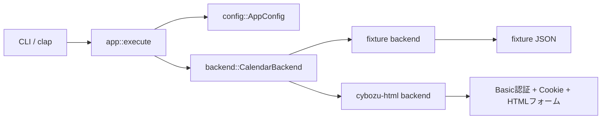

# アーキテクチャ

## 方針

最初から実サイト依存のコードに寄せすぎると、画面契約の採取前に設計が崩れます。  
そのため、CLI とドメイン操作を先に固め、実アクセスはバックエンド差し替えで扱います。

## 構成



## レイヤ

### `cli`

- コマンドライン引数の定義
- 日時パース
- 更新・複製オプションの整合性チェック

### `model`

- 予定データ構造
- 時間範囲の検証
- 更新パッチ適用
- 複製時の開始/終了時刻調整

### `backend`

- `CalendarBackend` trait
- `fixture` 実装
- `cybozu-html` 実装の入口

### `config`

- TOML 設定の読み込み
- 相対パスの解決
- `doctor` 向けの事前診断

## コマンド設計

```text
cbzcal doctor
cbzcal events list
cbzcal events add
cbzcal events update
cbzcal events clone
cbzcal events delete
```

出力は JSON に統一しています。  
将来的に他ツールからパイプしやすくするためです。

## `cybozu-html` バックエンドの想定責務

`cybozu-html` が実装されたら、最低でも次を担当します。

- Basic 認証付き HTTP クライアント生成
- Cookie セッション維持
- ログインページまたは SSO の通過
- 一覧画面から対象イベント ID を解決
- 詳細画面から hidden 項目を抽出
- 変更/複製/削除フォームの送信
- 権限不足や画面差分の検知

## なぜ `fixture` を先に入れるか

- CLI UX を先に固められる
- ドメインモデルを TDD で詰められる
- 実サイト接続なしでも回帰テストが回る
- HTML 契約採取後の差し替え範囲を限定できる
