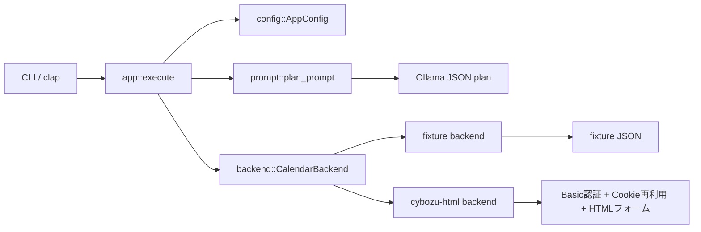

# アーキテクチャ

## 方針

最初から実サイト依存のコードに寄せすぎると、画面契約の採取前に設計が崩れます。  
そのため、CLI とドメイン操作を先に固め、実アクセスはバックエンド差し替えで扱います。

## 構成



## レイヤ

### `cli`

- コマンドライン引数の定義
- 日時パース
- `events` の既定を `list` に寄せる導線
- `events --prompt` の通常実行経路との排他制御
- 更新・複製オプションの整合性チェック

### `prompt`

- Ollama への JSON 生成依頼
- 自然文から `events list/add/update/clone/delete` への変換
- 実行前プレビュー文字列の生成
- `update/delete` では `--yes` を禁止する安全制御

### `model`

- 予定データ構造
- 公開/非公開の visibility 表現
- 時間範囲の検証
- 更新パッチ適用
- 複製時の開始/終了時刻調整

### `backend`

- `CalendarBackend` trait
- `fixture` 実装
- `cybozu-html` 実装の入口
- `cache` による予定データの永続化とサブレンジ・ヒット（包含関係）の最適化

### `view`

- 人間向けテキスト表示の生成
- 現在時刻に基づいた予定の強調（`>` プレフィックス）
- 現在位置を示すマーカー（`--- 現在 (HH:mm) ---`）の挿入
- JSON 出力（API 包絡線）

### `config`

- TOML 設定の読み込み
- 相対パスの解決
- セッション Cookie 保存先の解決
- `doctor` 向けの事前診断

## コマンド設計

```text
cbzcal doctor
cbzcal shell <bash|zsh|fish|powershell|elvish>
cbzcal events
cbzcal events list
cbzcal events add
cbzcal events update
cbzcal events clone
cbzcal events delete
cbzcal events --prompt "明日の15時から1時間、打ち合わせで追加"
```

`events` は subcommand 省略時に `list` として動きます。  
通常出力は人間向けのテキストで、`--json` を付けたときだけ JSON を返します。  
`-v` は認証経路やセッション再利用の補助情報を標準エラーに出します。
`--prompt` は実行前に必ず解釈結果と生成コマンドを表示し、既定では `[y/N]` で確認します。`--yes` は `list/add/clone` のみ省略可能で、`update/delete` では使えません。`add` では `公開` / `非公開` の意図を `--public` / `--private` に解釈します。

## `cybozu-html` バックエンドの想定責務

`cybozu-html` が実装されたら、最低でも次を担当します。

- Basic 認証付き HTTP クライアント生成
- Cookie セッション維持と再利用
- ログインページまたは SSO の通過
- 一覧画面から対象イベント ID を解決
- 詳細画面から hidden 項目を抽出
- 変更/複製/削除フォームの送信
- `--web` 用の予定詳細 URL 解決
- 権限不足や画面差分の検知

## キャッシュ戦略

`CachingBackend` は以下の最適化を行います。

- **サブレンジ・ヒット**: リクエストされた `from` 〜 `to` が、すでにキャッシュされているクエリの範囲内に完全に含まれる場合、バックエンド（実サイト）にアクセスせず、キャッシュ内のイベントから該当期間のものを抽出して返します。
- **通知の遅延**: キャッシュヒット時にはバックエンドを初期化しないため、不要な「セッション Cookie を読み込みました」といった詳細ログ（verbose）が出力されないよう、実際の通信が発生するまで通知を遅延させます。

## なぜ `fixture` を先に入れるか

- CLI UX を先に固められる
- ドメインモデルを TDD で詰められる
- 実サイト接続なしでも回帰テストが回る
- HTML 契約採取後の差し替え範囲を限定できる
