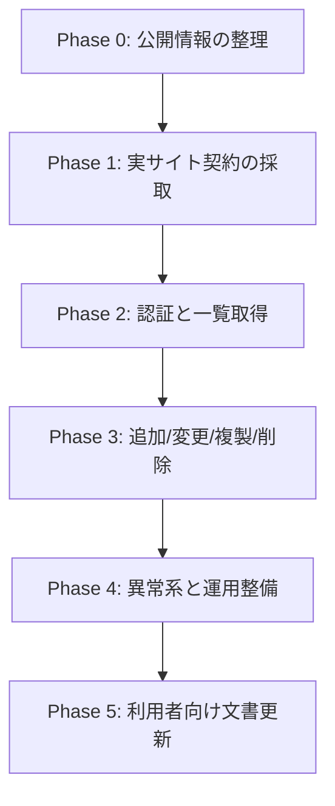

# 開発フロー

## 全体像

## Phase 0

このリポジトリですでに着手済みの内容です。

- 公開マニュアルの整理
- CLI 骨格
- `fixture` バックエンド
- テスト基盤
- 日本語ドキュメント

## Phase 1

実サイトに対して次を採取します。

開始方法は、まず制御可能なブラウザで対象 URL を開き、認証と画面遷移を観測することです。  
詳細な観測手順は [ブラウザ調査計画](04-browser-investigation.md) を参照してください。

- Basic 認証が 401 チャレンジかどうか
- Basic 認証後に Office ログイン画面が出るか
- 予定一覧画面と予定詳細画面の URL
- hidden 項目、フォーム action、submit 名
- CSRF トークンやワンタイム値の有無
- 繰り返し予定、複数参加者予定、施設予約の分岐

採取結果は `docs/01-research.md` に追記します。

## Phase 2

まずは読み取り系から進めます。

- `doctor` に到達確認を追加
- `probe-login` で Basic 認証 + Cybozu ログイン + `ScheduleIndex` 到達を確認する
- ログイン処理を `getToken.json -> login.json -> availableDays.json -> redirect.do` の順で実装する
- 一覧取得の HTML パーサを追加
- `data-cb-st` / `data-cb-et` の `dt` / `tm` / 終日表現を解釈する
- グループ週表示で重複する共有予定を `sEID + Date + BDate` 単位で畳む
- イベント ID と表示項目の対応を固定する
- 無指定の `events list` は JST 基準で 1 週間に制限する

この段階で `events list` を本番バックエンドで動かせるようにします。  
2026-03-09 時点で、この段階までは実サイト確認済みです。

## Phase 3

書き込み系は 1 操作ずつ進めます。

1. `events add`
2. `events update`
3. `events clone`
4. `events delete`

2026-03-09 時点で、1 の `events add`、2 の `events update`、4 の `events delete` は通常予定の単日操作まで実サイト確認済みです。  
残りは参加者追加・設備予約・複数日予定を含む add/update の拡張、delete の分岐対応、clone です。

各操作ごとに次を揃えます。

- 成功系テスト
- 権限不足テスト
- hidden 値欠落時の失敗
- 画面差分検知の失敗メッセージ

## Phase 4

異常系と運用準備を整えます。

- タイムアウト
- リトライ方針
- 監査ログに残す最低限の情報
- `.cbzcal.toml` の探索順と権限チェック
- `--dry-run` の追加可否
- 危険操作前の確認やバックアップ方針

## Phase 5

利用者向けに次を更新します。

- 設定例
- 必要な環境変数
- `.cbzcal.toml` の配置場所と `0400` / `0600` 要件
- 権限要件
- 既知の制約
- 運用手順

## TDD の基本ルール

- ドメインロジックは `fixture` で先にテストを書く
- 実サイト固有の処理は HTML スナップショットを fixture 化してから実装する
- 不明な hidden 項目は決め打ちしない
- 実サイトから採取した契約が変わったら、先にテスト fixture を更新する
