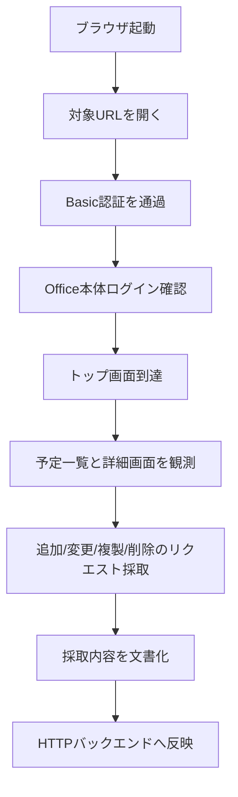

# ブラウザ調査計画

## 目的

今回の最優先課題は、`https://example.cybozu.com/o/ag.cgi` に対して、実サイトで成立している認証と画面遷移の契約を採取することです。  
公開マニュアルだけでは、追加・変更・複製・削除に必要なフォーム値や hidden 項目までは確定できません。

そのため、最初の調査は HTTP クライアント直打ちではなく、制御可能なブラウザで行います。

## なぜブラウザ主導にするか

- Basic 認証が前段で入っている
- Basic 認証通過後に別のログイン方式が続く可能性がある
- hidden 項目、CSRF、submit 名称が画面ごとに違う可能性がある
- UI 上でしか分岐が見えない操作がある
- 人間がログインできるなら、まず成功フローを観測する方が早い

## 調査の基本戦略



## フェーズ分割

### Phase A: 認証観測

目的:

- Basic 認証が 401 チャレンジなのかを確認する
- 認証後に Office ログイン画面があるかを確認する
- Cookie とリダイレクトの流れを把握する

観測対象:

- 初回アクセス URL
- 401 応答の有無
- `WWW-Authenticate` の有無
- 認証後の遷移先
- ログインフォームの `action`, `method`, input 名

### Phase B: 読み取り観測

目的:

- 一覧取得と詳細取得の画面契約を確定する

観測対象:

- 予定一覧画面の URL
- 日付条件が URL パラメータかフォームか
- イベント詳細画面へ遷移するリンクの形式
- イベント ID に相当する値

### Phase C: 書き込み観測

目的:

- 予定の追加・変更・複製・削除の送信契約を採取する

観測対象:

- フォーム `action`
- `method`
- hidden 項目
- submit ボタン名
- CSRF 相当の値
- 確認画面をはさむかどうか
- 成功後の戻り先 URL

### Phase D: 分岐観測

目的:

- 通常予定以外の分岐条件を把握する

優先順:

1. 参加者 1 人の通常予定
2. 参加者複数の通常予定
3. 施設付き予定
4. 繰り返し予定
5. 仮予定

## 調査時に必ず残すもの

- アクセスした URL
- 送信メソッド
- リクエストパラメータ
- 主要レスポンスの HTML スナップショット
- 画面上のボタン文言
- 操作前後の差分

## 記録テンプレート

各操作について、最低限次の形式で `docs/01-research.md` に追記します。

```md
## 操作名

- 日時:
- 事前状態:
- 開始URL:
- 遷移:
  - URL:
  - 画面名:
- 送信:
  - method:
  - action:
  - 主要パラメータ:
  - hidden:
- 成功条件:
- 失敗条件:
- 備考:
```

## 実装への落とし込み順

ブラウザ調査が終わったら、次の順でコードへ反映します。

1. `doctor` に接続前チェックを追加する
2. `probe-login` でヘッドレスログインと `ScheduleIndex` 到達を確認する
3. `events list` を `cybozu-html` で有効化する
4. `events add` を有効化する
5. `events update` を有効化する
6. `events clone` を有効化する
7. `events delete` を有効化する

## 作業ルール

- 本番データを壊さないため、調査用のユーザーと調査用の予定を使う
- 削除系は最後にまとめて行う
- 画面契約が不明なまま `reqwest` 実装を始めない
- 採取した HTML やフォーム情報は、可能なら fixture 化してテストに落とす

## この文書の使い方

この文書は、ブラウザでの調査そのものの手順書です。  
調査結果は別途 [調査メモ](01-research.md) に確定情報として転記します。

## 2026-03-09 時点の補足

- ヘッドレス実装では `/o/ag.cgi` が HTTP 302 ではなく `location.replace("/login?...")` を返す場合がある
- ログイン成功には `redirect.do` 単体ではなく `getToken.json -> login.json -> availableDays.json -> redirect.do` の順が必要
- そのため、ブラウザ調査で network を採るときは `api/auth/*.json` 系も必ず保持する
